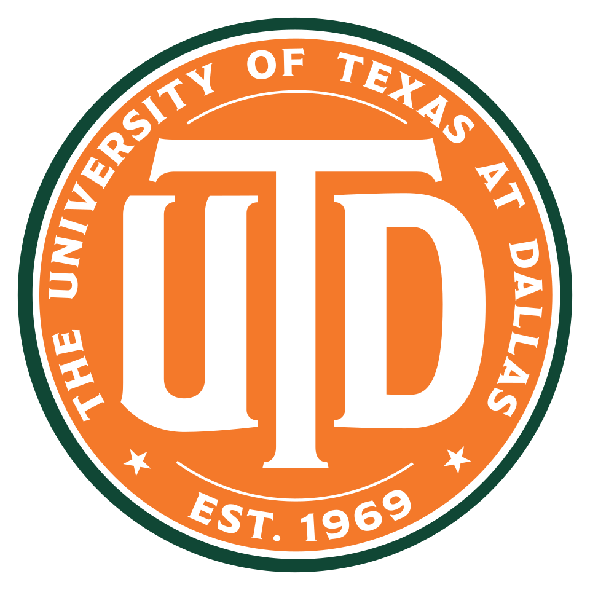

 &nbsp; Hi, I'm Preston. CS student at UT Dallas focused on AI agents, automation, and cloud infrastructure, striving towards a solutions-engineering adjacent role. 

Current Projects
1. _Agentic Luxury Resale Scraper_ (Python, LangGraph, LangChain)
   - A multi-agent system that scrapes clothing listings from [therealreal.com] optimizes for
  field coverage across listings, primarily through adaptive JSON-to-DOM selector configs dynamically adjusting per designer brand. Needs more thorough testing against specific designer brands. 

Past projects 
1. _Email Internship Automation Tool_ (Python, SQLite)
   - Multi-agent CLI tool that helps automates internship cold email outreach through coordinated Pydantic AI agents for email drafting and resume selection with JSON config-based control over tone, template, and word count.
2. _Conversational RAG System_ (Python, LangChain, Chainlit)  
   - Python RAG app for in-depth semantic search over iMessage conversations via contact-based extraction driven by a conversational disentanglement model to help extract granular conversation threads.
